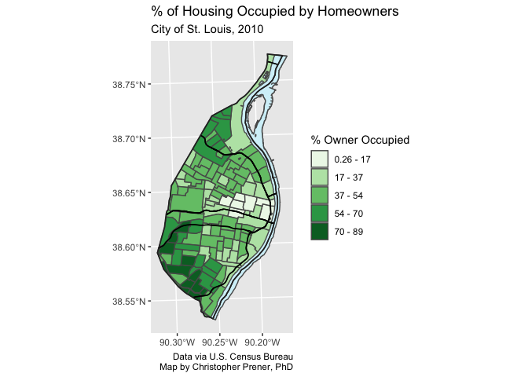

Lab 1-3 Replication
================
Christopher Prener, Ph.D.
(February 07, 2022)

## Introduction

This notebook provides a replication of Lab 1-3.

## Dependencies

This notebook requires the following packages:

``` r
# tidyverse packages
library(ggplot2)       # static mapping
```

    ## Warning in register(): Can't find generic `scale_type` in package ggplot2 to
    ## register S3 method.

``` r
# mapping packages
library(mapview)      # preview spatial data
library(sf)           # spatial tools
```

    ## Linking to GEOS 3.8.1, GDAL 3.2.1, PROJ 7.2.1; sf_use_s2() is TRUE

``` r
# other packages
library(here)         # file path management
```

    ## here() starts at /Users/prenercg/GitHub/slu-soc5650/module-1-cartography/assignments/lab-1-3-replication

``` r
library(RColorBrewer) # color brewer palettes
library(viridis)      # viridis color palettes
```

    ## Loading required package: viridisLite

We’ll also need a custom function that Chris has written for creating
map breaks:

``` r
source(here("source", "map_breaks.R"))
```

## Load Data

The data for this assigment are all in the `data/` folder, and include a
number of different layers:

``` r
# city boundary
stl_boundary <- st_read(here("data", "STL_BOUNDARY_City.geojson"))
```

    ## Reading layer `STL_BOUNDARY_City' from data source 
    ##   `/Users/prenercg/GitHub/slu-soc5650/module-1-cartography/assignments/lab-1-3-replication/data/STL_BOUNDARY_City.geojson' 
    ##   using driver `GeoJSON'
    ## Simple feature collection with 1 feature and 2 fields
    ## Geometry type: MULTIPOLYGON
    ## Dimension:     XY
    ## Bounding box:  xmin: 733360 ymin: 4268394 xmax: 746157.1 ymax: 4295511
    ## Projected CRS: NAD83 / UTM zone 15N

``` r
# water layers
il_hydro <- st_read(here("data", "IL_HYDRO_Mississippi.geojson"))
```

    ## Reading layer `IL_HYDRO_Mississippi' from data source 
    ##   `/Users/prenercg/GitHub/slu-soc5650/module-1-cartography/assignments/lab-1-3-replication/data/IL_HYDRO_Mississippi.geojson' 
    ##   using driver `GeoJSON'
    ## Simple feature collection with 4 features and 8 fields
    ## Geometry type: POLYGON
    ## Dimension:     XY
    ## Bounding box:  xmin: 739063 ymin: 4268279 xmax: 746617.9 ymax: 4295339
    ## Projected CRS: NAD83 / UTM zone 15N

``` r
stl_hydro <- st_read(here("data", "STL_HYDRO_AreaWater.geojson"))
```

    ## Reading layer `STL_HYDRO_AreaWater' from data source 
    ##   `/Users/prenercg/GitHub/slu-soc5650/module-1-cartography/assignments/lab-1-3-replication/data/STL_HYDRO_AreaWater.geojson' 
    ##   using driver `GeoJSON'
    ## Simple feature collection with 16 features and 2 fields
    ## Geometry type: POLYGON
    ## Dimension:     XY
    ## Bounding box:  xmin: 733468.5 ymin: 4268394 xmax: 746157.1 ymax: 4295418
    ## Projected CRS: NAD83 / UTM zone 15N

``` r
# highways
highways <- st_read(here("data", "STL_TRANS_PrimaryRoads", "STL_TRANS_PrimaryRoads.shp"))
```

    ## Reading layer `STL_TRANS_PrimaryRoads' from data source 
    ##   `/Users/prenercg/GitHub/slu-soc5650/module-1-cartography/assignments/lab-1-3-replication/data/STL_TRANS_PrimaryRoads/STL_TRANS_PrimaryRoads.shp' 
    ##   using driver `ESRI Shapefile'
    ## Simple feature collection with 9 features and 4 fields
    ## Geometry type: MULTILINESTRING
    ## Dimension:     XY
    ## Bounding box:  xmin: 733482 ymin: 4270554 xmax: 745666.9 ymax: 4294751
    ## Projected CRS: NAD83 / UTM zone 15N

``` r
# owner occupied housing
housing <- st_read(here("data", "STL_HOUSING_OwnerOccupied.geojson"))
```

    ## Reading layer `STL_HOUSING_OwnerOccupied' from data source 
    ##   `/Users/prenercg/GitHub/slu-soc5650/module-1-cartography/assignments/lab-1-3-replication/data/STL_HOUSING_OwnerOccupied.geojson' 
    ##   using driver `GeoJSON'
    ## Simple feature collection with 106 features and 5 fields
    ## Geometry type: MULTIPOLYGON
    ## Dimension:     XY
    ## Bounding box:  xmin: 733360 ymin: 4268410 xmax: 746170.8 ymax: 4295511
    ## Projected CRS: NAD83 / UTM zone 15N

We’re now ready to map these data.

## Part 1 - Exploration

In my console, I’ve used `mapview::mapview()` to explore each of these
different data sets. All are polygon data except for the highways, which
are line data.

## Part 2 - Mapping

The following code chunk creates map breaks using the “fisher” approach,
and then layers data on water features and highways over the census
tracts showing the percent of homes that are occupied by their owners.

``` r
## create breaks
housing <- map_breaks(housing, var = "pct_owner_occupied", newvar = "map_breaks",
                    style = "fisher", classes = 5, dig_lab = 2)

## map binned data
p1 <- ggplot() +
  geom_sf(data = stl_boundary, fill = "#ffffff", color = NA) +
  geom_sf(data = housing, mapping = aes(fill = map_breaks)) +
  geom_sf(data = il_hydro, fill = "#d4f1f9") +
  geom_sf(data = stl_hydro, fill = "#d4f1f9") +
  geom_sf(data = highways, color = "#000000") +
  geom_sf(data = stl_boundary, fill = NA, color = "#2a2a2a", size = .6) +
  scale_fill_brewer(palette = "Greens", name = "% Owner Occupied") +
  labs(
    title = "% of Housing Occupied by Homeowners",
    subtitle = "City of St. Louis, 2010",
    caption = "Data via U.S. Census Bureau\nMap by Christopher Prener, PhD"
  )

p1
```

<!-- -->

The map shows that owner occupied rates are highest in the southwest
portion of St. Louis. We’ll save it using the following code:

``` r
ggsave(plot = p1, filename = here("results", "owner_occupied_housing.png"))
```

    ## Saving 7 x 5 in image

The map is now saved for dissemination!
