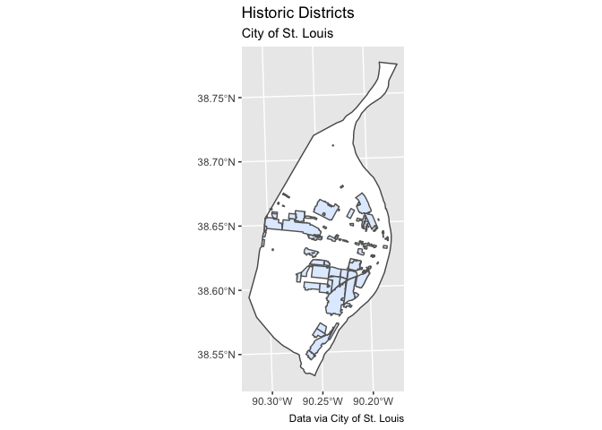
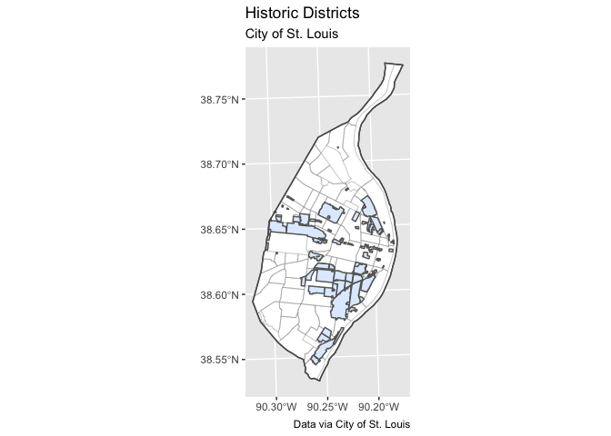
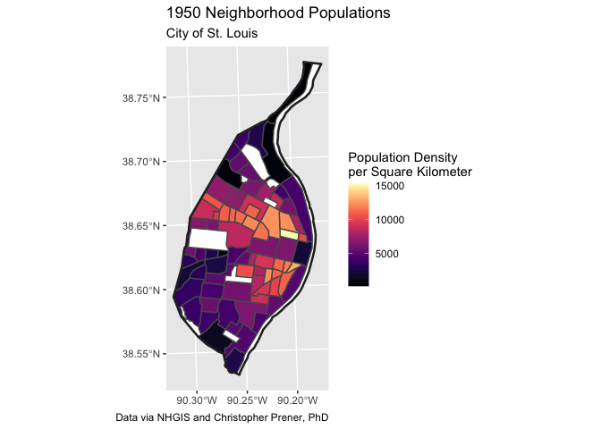

Meeting-03 Meeting Notebook - Complete
================
Christopher Prener, Ph.D.
(February 15, 2021)

## Introduction

This notebook provides a walk-through of the example code used in class.

## Dependencies

This notebook requires the following packages:

``` r
# tidyverse packages
library(ggplot2)       # static mapping

# mapping packages
library(mapview)      # preview spatial data
```

    ## GDAL version >= 3.1.0 | setting mapviewOptions(fgb = TRUE)

``` r
library(sf)           # spatial tools
```

    ## Linking to GEOS 3.8.1, GDAL 3.1.4, PROJ 6.3.1

``` r
# other packages
library(here)         # file path management
```

    ## here() starts at /Users/chris/GitHub/slu-soc5650/content/module-1-cartography

``` r
library(RColorBrewer) # color brewer palettes
library(viridis)      # viridis color palettes
```

    ## Loading required package: viridisLite

We’ll also need a custom function that Chris has written for creating
map breaks:

``` r
source(here("source", "map_breaks.R"))
```

The `source()` function executes “R script” files, which can either be
used to define functions used in a project or run a subset of other code
contained in that file.

## Load Data

We’ll be using two sets of data today, neighborhood boundaries and the
regions of St. Louis City that are historic districts. Both data sets
are included in the `data/exercise_data` folder:

``` r
city <- st_read(here("data", "STL_BOUNDARY_City.geojson"))
```

    ## Reading layer `STL_BOUNDARY_City' from data source `/Users/chris/GitHub/slu-soc5650/content/module-1-cartography/data/STL_BOUNDARY_City.geojson' using driver `GeoJSON'
    ## Simple feature collection with 1 feature and 2 fields
    ## geometry type:  MULTIPOLYGON
    ## dimension:      XY
    ## bbox:           xmin: 733360 ymin: 4268394 xmax: 746157.1 ymax: 4295511
    ## projected CRS:  NAD83 / UTM zone 15N

``` r
nhood <- st_read(here("data", "exercise_data", "STL_DEMOGRAPHICS_Nhoods", "STL_DEMOGRAPHICS_Nhoods.shp"))
```

    ## Reading layer `STL_DEMOGRAPHICS_Nhoods' from data source `/Users/chris/GitHub/slu-soc5650/content/module-1-cartography/data/exercise_data/STL_DEMOGRAPHICS_Nhoods/STL_DEMOGRAPHICS_Nhoods.shp' using driver `ESRI Shapefile'
    ## Simple feature collection with 79 features and 5 fields
    ## geometry type:  MULTIPOLYGON
    ## dimension:      XY
    ## bbox:           xmin: 733361.8 ymin: 4268512 xmax: 745417.9 ymax: 4295501
    ## projected CRS:  UTM_Zone_15_Northern_Hemisphere

``` r
historic <- st_read(here("data", "exercise_data", "STL_HISTORICAL_Districts", "STL_HISTORICAL_Districts.shp"))
```

    ## Reading layer `STL_HISTORICAL_Districts' from data source `/Users/chris/GitHub/slu-soc5650/content/module-1-cartography/data/exercise_data/STL_HISTORICAL_Districts/STL_HISTORICAL_Districts.shp' using driver `ESRI Shapefile'
    ## Simple feature collection with 102 features and 4 fields
    ## geometry type:  MULTIPOLYGON
    ## dimension:      XY
    ## bbox:           xmin: 734470.2 ymin: 4269761 xmax: 745405.8 ymax: 4288348
    ## projected CRS:  NAD83 / UTM zone 15N

## Manually Applying Colors

One task when we are working with multi-layer maps is arbitrarily
setting the colors we assign to a given layer. We can use the `fill`
argument in `geom_sf` *outside* of an aesthetic mapping to set the fill,
and the `color` argument to set the hue of the border colors.

``` r
p1 <- ggplot() +
  geom_sf(data = historic, fill = "#ffe4e1", color = "#a9a9a9") +
  labs(
    title = "Historic Districts",
    subtitle = "City of St. Louis",
    caption = "Data via City of St. Louis"
  )

p1
```

<!-- -->

Now, take a moment and use [ColorHexa.com](https://www.colorhexa.com) to
change the fill to a *cool* color and select a darker shade of gray for
the border:

``` r
p2 <- ggplot() +
  geom_sf(data = historic, fill = "#e1edff", color = "#838383") +
  labs(
    title = "Historic Districts",
    subtitle = "City of St. Louis",
    caption = "Data via City of St. Louis"
  )

p2
```

<!-- -->

## Layering with ggplot2

The maps we made above help identify the historic districts, but they
are devoid of context because the lack the boundary for the City of
St. Louis. Let’s go ahead an add that. We’ll set the fill for the city
boundary to white so that our historic districts really stand out.

``` r
p3 <- ggplot() +
  geom_sf(data = city, fill = "#ffffff") +
  geom_sf(data = historic, fill = "#e1edff", color = "#646464") +
  labs(
    title = "Historic Districts",
    subtitle = "City of St. Louis",
    caption = "Data via City of St. Louis"
  )

p3
```

<!-- -->

Next, we’ll overlay the historic districts on the City’s neighborhood
boundaries to add some additional context. We’ll set the fill for the
neighborhood boundaries to `NA` so that they are hollow, use a light
gray color, and set the size to `.2` so that they are thinner than the
default width. Finally, we’ll add the `city` data on top as well so that
the City’s boundary stands out.

``` r
p4 <- ggplot() +
  geom_sf(data = city, fill = "#ffffff") +
  geom_sf(data = nhood, fill = NA, color = "#a9a9a9", size = .2) +
  geom_sf(data = historic, fill = "#e1edff", color = "#646464") +
  geom_sf(data = city, fill = NA) +
  labs(
    title = "Historic Districts",
    subtitle = "City of St. Louis",
    caption = "Data via City of St. Louis"
  )

p4
```

<!-- -->

## Thematic Mapping with viridis and Color Brewer

The other topic for this week is to create maps that have different
color ramps. Last week, we introduce the `virids` color palettes. We can
illustrate that for review by mapping the 1950 populations of
St. Louis’s neighborhoods, with the addition of a ground layer
representing the city boundary:

``` r
p5 <- ggplot() +
  geom_sf(data = city, fill = "#ffffff", color = NA) +
  geom_sf(data = nhood, mapping = aes(fill = pop50_den)) +
  geom_sf(data = city, fill = NA, color = "#2a2a2a", size = .9) +
  scale_fill_viridis(name = "Population Density\nper Square Kilometer") +
  labs(
    title = "1950 Neighborhood Populations",
    subtitle = "City of St. Louis",
    caption = "Data via NHGIS and Christopher Prener, PhD"
  )

p5
```

<!-- -->

The viridis package contains four other palettes: “magma”, “plasma”, and
“inferno” all look somewhat similar, and then the alternate “cividis”
palette. You can specify them with the `option` argument in
`scale_fill_viridis`:

``` r
p6 <- ggplot() +
  geom_sf(data = city, fill = "#ffffff", color = NA) +
  geom_sf(data = nhood, mapping = aes(fill = pop50_den)) +
  geom_sf(data = city, fill = NA, color = "#2a2a2a", size = .9) +
  scale_fill_viridis(option = "magma", name = "Population Density\nper Square Kilometer") +
  labs(
    title = "1950 Neighborhood Populations",
    subtitle = "City of St. Louis",
    caption = "Data via NHGIS and Christopher Prener, PhD"
  )

p6
```

<!-- -->

This map is a bit hard to read because the color ramp is continuous. We
can bin our data using one of a number of algorithms - “equal”,
“pretty”, “quantile”, “fisher”, and “jenks” are the best options to
choose from. Typically we don’t want more than 5 or 6 breaks. We can
also switch to using `RColorBrewer` instead.

``` r
## create breaks
nhood <- map_breaks(nhood, var = "pop50_den", newvar = "map_breaks",
                    style = "quantile", classes = 5, dig_lab = 5)

## map binned data
p7 <- ggplot() +
  geom_sf(data = city, fill = "#ffffff", color = NA) +
  geom_sf(data = nhood, mapping = aes(fill = map_breaks)) +
  geom_sf(data = city, fill = NA, color = "#2a2a2a", size = .9) +
  scale_fill_brewer(palette = "RdPu", name = "Population Density\nper Square Kilometer") +
  labs(
    title = "1950 Neighborhood Populations",
    subtitle = "City of St. Louis",
    caption = "Data via NHGIS and Christopher Prener, PhD"
  )

p7
```

<!-- -->

You can use the `display.brewer.all()` function to get a preview of
other options in the `RColorBrewer` package. Take a few minutes to
modify `p7` using different palette options and approaches to making
breaks.
